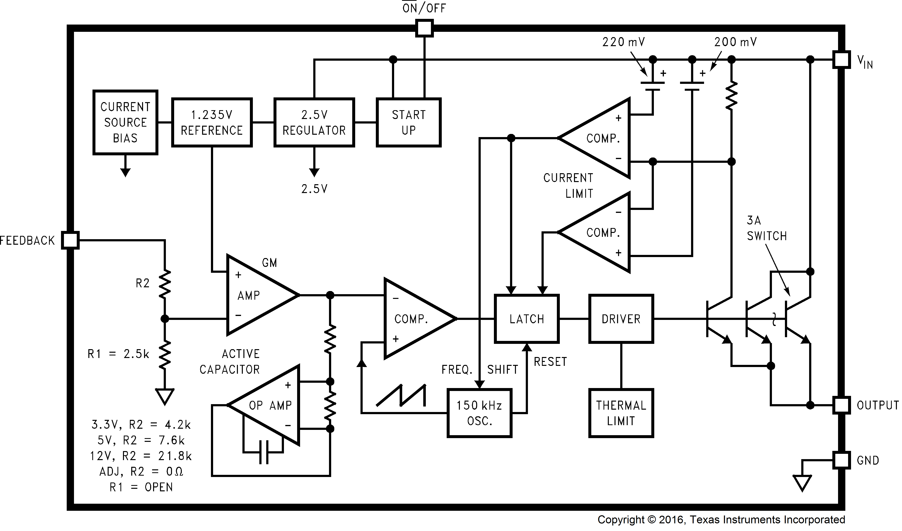

# LM2596 Module Background

## Introduction

The objective of this project is to characterize the electrical behavior of a commercial LM2596-based buck converter module through simulation and laboratory measurement. Prior to collecting experimental data, it is important to establish an understanding of the converter architecture, operating principles, and expected waveforms.

The LM2596 is a monolithic step-down (buck) switching regulator capable of supplying up to 3 A of output current while operating at a nominal switching frequency of 150 kHz. Due to its low cost, wide input voltage range, and minimal external component requirements, the device is commonly found in commercial DC-DC converter modules and hobbyist power electronics applications.

Unlike a linear regulator, which dissipates excess energy as heat, the LM2596 regulates output voltage by rapidly switching an internal power transistor and controlling the flow of energy through an external inductor-capacitor network. This switching behavior allows the converter to achieve significantly higher efficiency than comparable linear regulator solutions.

For this project, understanding the internal operation of the LM2596 serves two purposes:

1. To establish expected converter behavior prior to physical testing.
2. To provide a framework for interpreting simulation and measurement results.

The following sections examine the major functional blocks of the LM2596 and discuss how the regulator determines duty cycle, maintains output regulation, and responds to changing load conditions.

## Question 1: How Does the LM2596 Determine Duty Cycle?



**Figure X. Internal functional block diagram of the LM2596 adjustable regulator.**

A fundamental question when studying the LM2596 is understanding how the regulator determines the duty cycle required to maintain a desired output voltage.

Unlike the ideal buck converter developed in Stage 1, where the duty cycle was manually specified through a pulse source, the LM2596 continuously adjusts its switching behavior using a closed-loop feedback control system. The signal path responsible for regulation can be traced directly through the internal functional blocks shown in Figure X.

### Internal Voltage Reference

The regulation process begins in the upper-left portion of the block diagram. A current source bias circuit generates an internal reference voltage of approximately 1.235 V, which serves as the target operating point for the entire feedback system.

The regulator does not directly regulate the output voltage. Instead, it attempts to maintain:

$$
V_{FB} \approx 1.235V
$$

where \(V_{FB}\) is the voltage present at the feedback pin.

This internal reference acts as the "desired value" against which the output voltage is continuously compared.

### Feedback Network

The feedback path can be seen on the left side of the block diagram. An external resistor divider formed by \(R_1\) and \(R_2\) scales the output voltage and applies a fraction of the output voltage to the feedback pin.

The relationship between output voltage and feedback voltage is:

$$
V_{FB}=V_{OUT}\left(\frac{R_{LOWER}}{R_{UPPER}+R_{LOWER}}\right)
$$

When the feedback voltage equals the internal reference voltage, the regulator is considered to be in equilibrium.

For the adjustable regulator:

$$
V_{OUT}=1.235\left(1+\frac{R_{UPPER}}{R_{LOWER}}\right)
$$

As a result, the resistor divider ultimately determines the desired output voltage.

### Error Amplifier

The first major control element encountered in the signal path is the transconductance error amplifier (GM AMP) shown near the center-left portion of the block diagram.

The error amplifier compares the feedback voltage against the internal 1.235 V reference and produces an error signal proportional to the difference between the two quantities:

$$
V_{ERR}\propto(V_{REF}-V_{FB})
$$

If the output voltage decreases:

$$
V_{FB}<V_{REF}
$$

the amplifier increases its output.

If the output voltage increases:

$$
V_{FB}>V_{REF}
$$

the amplifier decreases its output.

The resulting error signal contains information describing whether the converter must deliver more or less energy to the output.

### Compensation Network

Immediately below the GM amplifier is the internal compensation circuitry labeled "Active Capacitor" and "OP AMP." Together, these blocks shape the dynamic response of the control loop before the signal reaches the PWM comparator.

The purpose of compensation is not to directly determine duty cycle, but rather to control how aggressively the regulator reacts to changes in output voltage.

Without adequate compensation, the converter could respond too aggressively to voltage errors, resulting in excessive overshoot, undershoot, or oscillatory behavior. The compensated error signal therefore becomes the control quantity used by the pulse-width modulation system.

### Oscillator and PWM Generation

Near the bottom center of the block diagram is the fixed-frequency oscillator labeled "150 kHz OSC."

The oscillator establishes the switching frequency of the regulator:

$$
f_s = 150kHz
$$

corresponding to a switching period of:

$$
T_s = 6.67\mu s
$$

The oscillator generates a repeating ramp waveform that is applied to the PWM comparator located immediately to the right of the compensation circuitry.

The PWM comparator continuously compares:

- The compensated error signal
- The oscillator ramp waveform

The point at which these signals intersect determines the switch on-time for the current switching cycle.

If the output voltage falls below the desired value, the error signal increases and the switch remains on for a longer portion of the switching period.

If the output voltage rises above the desired value, the error signal decreases and the switch turns off sooner.

The duty cycle is therefore adjusted automatically to maintain output regulation.

### Latch and Driver Operation

The output of the PWM comparator is connected directly to the latch block shown near the center-right portion of the diagram.

At the beginning of each switching cycle:

1. The oscillator initiates a new cycle.
2. The latch is set.
3. The driver turns on the internal power switch.

As the oscillator ramp increases, it is continuously compared against the compensated error signal.

When the comparator threshold is reached:

1. The latch is reset.
2. The driver turns off the power switch.
3. The inductor current freewheels through the external Schottky diode.

The latch therefore acts as the timing element that converts the PWM command into a discrete switching pulse.

### Internal Power Switch

The final stage of the control path is the integrated 3 A power switch located on the right side of the block diagram.

The driver controls this switch directly. When the switch turns on, energy is transferred from the input supply into the buck converter power stage. When the switch turns off, the inductor current continues flowing through the freewheeling diode and output filter network.

The resulting output voltage is then sensed by the feedback divider, completing the closed-loop regulation process.

### Summary

Following the signal path through Figure X:

1. The 1.235 V reference establishes the desired feedback voltage.
2. The feedback divider scales the output voltage and produces \(V_{FB}\).
3. The GM amplifier compares \(V_{FB}\) against the reference and generates an error signal.
4. The compensation network shapes the response of the control loop.
5. The PWM comparator compares the compensated error signal against the 150 kHz oscillator ramp.
6. The latch and driver translate the PWM command into switching action.
7. The internal 3 A switch delivers energy to the buck converter power stage.
8. The resulting output voltage is fed back to the feedback pin, closing the regulation loop.

## Question 2: What is the purpose of the inductor?

The inductor serves as the primary energy storage element within the LM2596 buck converter. Its purpose is to transform the pulsed voltage generated by the internal power switch into a continuous current supplied to the load.

The behavior of the inductor is governed by:

$$
V_L = L\frac{dI_L}{dt}
$$

or equivalently,

$$
\frac{dI_L}{dt} = \frac{V_L}{L}
$$

This relationship shows that the voltage across the inductor determines the rate at which the current changes.

During the switch on-time, the switching node is connected to the input supply, causing the inductor to experience a positive voltage approximately equal to:

$$
V_L \approx V_{IN} - V_{OUT}
$$

For the simulated operating point of \(V_{IN}=12\,V\) and \(V_{OUT}=3\,V\),

$$
V_L \approx 9\,V
$$

This positive voltage produces a positive current slope, causing the inductor current to increase linearly.

During the switch off-time, current continues to flow through the Schottky diode and the voltage across the inductor reverses:

$$
V_L \approx -V_{OUT}
$$

or approximately

$$
V_L \approx -3\,V
$$

The resulting negative voltage causes the inductor current to decrease linearly.

Because the inductor experiences nearly constant voltage during both the on and off intervals, the current waveform consists of alternating linear ramps. This produces the characteristic triangular current waveform observed in the Stage 2 simulation.

The inductance value directly influences the magnitude of current ripple. Since

$$
\frac{dI_L}{dt} = \frac{V_L}{L}
$$

larger inductance values reduce current ripple but slow the converter's dynamic response, while smaller inductance values increase current ripple and allow the current to respond more quickly to changes in operating conditions.

The Stage 2 simulation demonstrates that the selected 47 µH inductor maintains a continuous current waveform throughout the switching cycle. The inductor current never reaches zero, indicating operation in Continuous Conduction Mode (CCM). This operating mode is consistent with the intended operating region of the LM2596 under moderate-to-high load conditions.

In summary, the inductor performs two critical functions within the converter:

1. It stores and releases energy during each switching cycle.
2. It converts the pulsed switching waveform into a nearly continuous output current.

Together with the output capacitor, the inductor forms the output filter responsible for producing a regulated DC output voltage from the high-frequency switching waveform generated by the regulator.

# Question 3: Why Does the LM2596 Use a Schottky Diode?

## Introduction

The previous discussion established how the LM2596 determines duty cycle through its internal feedback and PWM control system and how the inductor stores and transfers energy during each switching cycle. Another critical component in the power stage is the freewheeling diode connected between the switching node and ground.

Although the diode appears to be a simple component, its electrical characteristics directly influence converter efficiency, thermal performance, and switching behavior. Understanding why the LM2596 requires a Schottky diode provides additional insight into the operation of the converter and helps explain several observations made during simulation.

---

## Role of the Diode in the Buck Converter

When the internal power switch is turned on, current flows from the input supply through the switch and into the inductor.

```text
VIN → Internal Switch → Inductor → Load
```

During this interval, energy is stored in the magnetic field of the inductor.

When the switch turns off, the current through the inductor cannot change instantaneously. The inductor therefore attempts to maintain current flow by generating whatever voltage is necessary to keep current moving in the same direction.

As the switching node voltage falls below ground, the diode becomes forward biased and provides a path for the inductor current.

```text
Inductor → Load → Ground → Schottky Diode → Inductor
```

This process is commonly referred to as **freewheeling**.

Without the diode, the inductor current would have no path during the off interval, resulting in large voltage spikes and improper converter operation.

---

## Why a Schottky Diode?

A conventional rectifier diode consists of a PN junction formed between p-type and n-type semiconductor materials.

A Schottky diode instead forms a junction between a metal and an n-type semiconductor.

This construction produces several characteristics that are advantageous for switching power supplies:

- Lower forward voltage drop
- Lower stored charge
- Lower junction capacitance
- Faster switching speed
- Negligible reverse recovery

These characteristics reduce both conduction losses and switching losses within the converter.

---

## Impact on Converter Efficiency

The power dissipated within a conducting diode can be approximated by:

$$
P_D = V_F I_D
$$

where:

- $P_D$ is diode power dissipation
- $V_F$ is forward voltage drop
- $I_D$ is diode current

For a buck converter, the diode only conducts during the switch off interval. The average diode loss can therefore be approximated as:

$$
P_D \approx V_F I_D (1-D)
$$

where $D$ is the converter duty cycle.

For the simulated operating condition:

$$
V_{IN}=12V
$$

$$
V_{OUT}=3V
$$

the ideal duty ratio is approximately:

$$
D \approx \frac{V_{OUT}}{V_{IN}}
= \frac{3}{12}
=0.25
$$

meaning the diode conducts for approximately:

$$
1-D=0.75
$$

or 75% of every switching cycle.

This demonstrates why diode losses can become significant at higher load currents.

---

## Connection to the Physical Module

Inspection of the physical LM2596 module revealed that the freewheeling diode installed on the board is an **SS34 Schottky rectifier**.

This observation was important because the original Stage 2 simulation used a 1N582x-family Schottky diode model obtained from an external reference design.

Although both devices are Schottky rectifiers, they are not identical. Differences in forward voltage drop, leakage current, junction capacitance, and switching behavior can influence converter performance.

As a result, the original model did not accurately represent the hardware configuration of the physical module.

---

## Stage 2b Model Refinement

To improve model fidelity, the original 1N582x model was replaced with an LTspice-native **SS3P5 Schottky diode model**.

The SS3P5 was selected as an intermediate substitute because:

- It is readily available within LTspice.
- It is intended for switching power supply applications.
- It possesses a similar current rating to the SS34.
- It provides a closer approximation to the installed hardware than the original 1N582x model.

This refinement resulted in the creation of the **Stage 2b model**, which retained the same LM2596 control loop, feedback network, inductor, capacitor, and load structure while modifying only the freewheeling diode.

---

## Load Current Sweep Investigation

After implementing the SS3P5 model, a load-current sweep was performed from 0.25 A to 3.0 A.

The purpose of the sweep was to evaluate:

- Output voltage regulation
- Output voltage ripple
- Inductor current ripple
- Conduction-mode transitions
- Estimated efficiency

The simulation demonstrated that the converter remained regulated throughout the operating range while transitioning from Discontinuous Conduction Mode (DCM) at lighter loads to Continuous Conduction Mode (CCM) near the upper end of the current range.

At the 3 A operating point, the model predicted an efficiency of approximately 74%, which is comparable to the efficiency values reported in the LM2596 datasheet under similar operating conditions.

Because the SS3P5 remains a substitute rather than the actual SS34 device, these results should be interpreted as preliminary estimates rather than final performance predictions.

---

## Summary

The Schottky diode is an essential component of the LM2596 power stage because it provides the current path required during the switch off interval. Its low forward voltage drop and fast switching characteristics reduce converter losses and improve efficiency compared to a conventional PN-junction rectifier.

Investigation of the physical converter module revealed that an SS34 Schottky diode is used in the hardware. This observation motivated the development of the Stage 2b model, which replaced the original 1N582x diode model with an SS3P5 substitute and enabled a systematic load-current sweep. The resulting simulations provided improved insight into converter regulation, conduction-mode transitions, and efficiency trends while establishing a foundation for future refinement using an SS34-specific SPICE model.

# Question 4: What Role Does the Output Capacitor Play in the LM2596 Converter?

## Introduction

The previous discussion established that the inductor serves as the primary energy storage element within the buck converter and is responsible for smoothing the current delivered to the load. However, the inductor current is not perfectly constant. Instead, it contains a triangular ripple component that varies throughout each switching cycle.

If this ripple current were applied directly to the load, the output voltage would exhibit significant variation. To reduce this voltage ripple and produce a stable DC output, the LM2596 employs an output capacitor connected across the load.

Together, the inductor and capacitor form an LC low-pass filter that converts the switched waveform generated by the regulator into a regulated DC output voltage.

---

## Capacitor Fundamentals

The behavior of a capacitor is governed by:

$$
I_C = C\frac{dV_C}{dt}
$$

or equivalently,

$$
\frac{dV_C}{dt} = \frac{I_C}{C}
$$

This relationship shows that a capacitor's voltage can only change when current flows into or out of the device.

Unlike an inductor, which resists changes in current, a capacitor resists changes in voltage. As a result, capacitors are commonly used to smooth voltage variations and reduce ripple in power electronic systems.

---

## Interaction Between the Inductor and Capacitor

The output capacitor does not operate independently. Instead, it works together with the inductor to form the converter output filter.

The relationship between the capacitor current, inductor current, and load current can be expressed as:

$$
I_C = I_L - I_{LOAD}
$$

This equation provides important insight into the role of the capacitor.

When:

$$
I_L > I_{LOAD}
$$

the excess current charges the capacitor.

When:

$$
I_L < I_{LOAD}
$$

the capacitor discharges and supplies the difference between the available inductor current and the current required by the load.

The capacitor therefore acts as a temporary energy reservoir, continuously absorbing and releasing energy during each switching cycle.

---

## Energy Flow During a Switching Cycle

During the switch on-time, the inductor current increases as energy is stored in the magnetic field of the inductor.

If the inductor current exceeds the load current, the excess current charges the output capacitor:

```text
Inductor → Capacitor + Load
```

During the switch off-time, the inductor current decreases as energy is released through the freewheeling diode.

If the inductor current falls below the load current, the capacitor discharges and supplements the available current:

```text
Inductor + Capacitor → Load
```

As a result, the load experiences a relatively constant voltage despite the presence of ripple current in the inductor.

---

## The LC Output Filter

The output filter consists of the inductor and capacitor operating together:

```text
Switching Node
      ↓
      L
      ↓
      C
      ↓
     Load
```

This network functions as a low-pass filter.

The inductor impedes high-frequency current ripple while allowing DC current to pass.

The capacitor provides a low-impedance path for high-frequency ripple current while blocking DC current flow.

Together, these components attenuate the switching-frequency content generated by the regulator and produce a nearly constant output voltage.

Without the output capacitor, the load would experience substantially larger voltage ripple and poorer regulation.

---

## Capacitor ESR

Real capacitors are not ideal devices. Every practical capacitor contains a small series resistance known as Equivalent Series Resistance (ESR).

A simplified capacitor model can be represented as:

```text
        ESR
---------R---------
          |
          C
          |
--------------
```

The ESR contributes directly to output ripple voltage through:

$$
V_{ESR} = I_C \cdot ESR
$$

Because the ripple current flowing through the capacitor is approximately equal to the ripple current generated by the inductor, the resulting ripple voltage can be approximated by:

$$
\Delta V_{ESR}
\approx
\Delta I_L \cdot ESR
$$

This ripple component is often significant in switching power supplies.

---

## ESR and Filter Damping

Although ESR increases ripple voltage, it also provides damping to the LC filter.

Without damping, energy can oscillate between:

- The magnetic field of the inductor
- The electric field of the capacitor

This behavior can produce ringing and undesirable transient response.

The ESR dissipates a portion of this energy as heat, reducing oscillation and improving filter stability.

As a result:

- Higher ESR generally increases ripple voltage.
- Higher ESR generally increases damping.
- Lower ESR generally reduces ripple voltage.
- Lower ESR generally reduces damping.

This tradeoff is one reason why capacitor selection is important in switching regulator design.

---

## Connection to the LM2596

The LM2596 relies on the output capacitor to maintain a stable output voltage while the converter continuously switches at approximately 150 kHz.

Although the internal control loop adjusts duty cycle to regulate the output voltage, the capacitor is responsible for filtering the remaining switching ripple that reaches the output stage.

The datasheet places significant emphasis on capacitor selection because both capacitance and ESR directly influence:

- Output voltage ripple
- Load transient response
- LC filter behavior
- Overall converter performance

As a result, the output capacitor is not simply an auxiliary component but a critical element of the converter power stage.

---

## Summary

The output capacitor serves as the primary voltage-smoothing element within the LM2596 converter. While the inductor smooths current, the capacitor smooths voltage by absorbing and releasing energy whenever the inductor current differs from the load current.

The relationship

$$
I_C = I_L - I_{LOAD}
$$

captures this behavior and explains how the capacitor reduces output voltage ripple despite the presence of triangular inductor current.

Together, the inductor and capacitor form an LC low-pass filter that attenuates switching-frequency components and produces a regulated DC output voltage.

The capacitor's ESR introduces additional ripple voltage but also provides damping to the LC filter, making capacitor selection an important factor in converter performance and stability.
