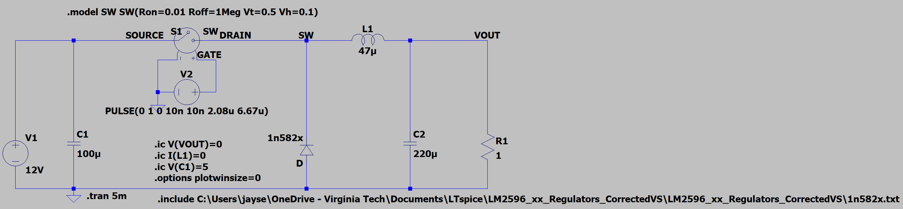

# Model 1: Ideal Voltage-Controlled Switch Buck Converter

## Purpose

Model 1 serves as the initial simulation environment used to verify the fundamental operating principles of a buck converter prior to introducing the LM2596 controller model and associated feedback circuitry.

The objective of this model is to develop intuition regarding:

- Switching node behavior
- Duty-cycle control
- Inductor current ripple
- Output voltage ripple
- Continuous-conduction mode (CCM) operation
- Startup transient behavior

By beginning with an idealized switching element, the behavior of the power stage can be studied independently from the complexities of closed-loop regulation.

---

## Circuit Description



### Figure 1. LTspice implementation of the Model 1 ideal buck converter.

The converter consists of the following elements:

| Component | Description |
|------------|------------|
| V1 | 12 V DC input source |
| S1 | Ideal voltage-controlled switch |
| V2 | Pulse source controlling switch operation |
| D1 | Freewheeling Schottky diode (1N582x model) |
| L1 | 47 µH output inductor |
| C1 | 100 µF input capacitor |
| C2 | 220 µF output capacitor |
| R1 | 1 Ω load resistor |

The ideal switch is controlled by a periodic pulse waveform operating at approximately 150 kHz. The pulse width was selected to produce an output voltage near 3 V when supplied from a 12 V input source.

---

## Switching Strategy

Switch control is provided by the pulse source:

```text
PULSE(0 1 0 10n 10n 2.08u 6.67u)
