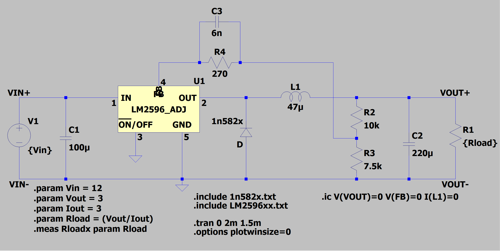

# Stage 2: LM2596 Macro-Model Reconstruction

## Purpose

Stage 2 replaces the ideal voltage-controlled switch used in Stage 1 with the LM2596 adjustable regulator macro-model. The objective is to introduce the regulator's internal control loop, feedback regulation, and switching behavior while maintaining a manageable level of model complexity.

This stage serves as the first attempt to replicate the behavior of the commercial LM2596 module used in the physical characterization project.

Unlike the ideal converter of Stage 1, output voltage regulation is no longer established through a manually selected duty cycle. Instead, the LM2596 controller adjusts its switching behavior in response to the feedback voltage in order to maintain the desired output voltage.

---

## Circuit Description

### Figure 1. LTspice implementation of the LM2596 adjustable buck converter model.

The converter consists of the following major components:

| Component | Description |
|------------|------------|
| U1 | LM2596 adjustable regulator macro-model |
| V1 | 12 V DC input source |
| D1 | 1N582x Schottky freewheeling diode |
| L1 | 47 µH output inductor |
| C1 | 100 µF input capacitor |
| C2 | 220 µF output capacitor |
| R1 | Resistive load |
| R2-R3 | Output voltage feedback divider |
| R4-C3 | Compensation network |

---

## Feedback Network Reconstruction

The adjustable LM2596 regulates its output by maintaining approximately 1.23 V at the feedback pin.

The feedback divider consists of:

| Component | Value |
|------------|------------|
| R2 | 10 kΩ |
| R3 | 7.5 kΩ |

The divider scales the output voltage and presents a fraction of the output voltage to the feedback node.

Steady-state regulation occurs when:

\[
V_{FB} \approx 1.23V
\]

which corresponds to the LM2596 internal reference voltage.

---

## Compensation Network

A compensation network was added between the output voltage and feedback node:

| Component | Value |
|------------|------------|
| R4 | 270 Ω |
| C3 | 6 nF |

This network introduces additional frequency-dependent behavior intended to stabilize the control loop and reduce undesirable oscillations.

The exact values were selected based on inspection of the physical converter module and iterative simulation refinement.

---

## Simulation Parameters

| Parameter | Value |
|------------|------------|
| Input Voltage | 12 V |
| Output Voltage Target | 3 V |
| Load Current Target | 3 A |
| Output Inductor | 47 µH |
| Output Capacitor | 220 µF |
| Input Capacitor | 100 µF |
| Simulation Length | 2 ms |
| Data Collection Start | 1.5 ms |

The transient analysis was configured to begin waveform collection after startup transients had substantially decayed, allowing steady-state behavior to be examined directly.

---

## Initial Conditions

The simulation was initialized using:

| Quantity | Initial Value |
|------------|------------|
| VOUT | 0 V |
| VFB | 0 V |
| IL | 0 A |

These conditions provide a controlled startup sequence and improve convergence of the regulator macro-model.

---

## Included Effects

Compared to Stage 1, the following additional behaviors are now represented:

- Closed-loop voltage regulation
- Internal LM2596 switching control
- Feedback regulation
- Duty-cycle adjustment
- Compensation network dynamics
- Schottky diode nonidealities

---

## Remaining Simplifications

Several effects are still omitted:

- PCB trace parasitics
- Capacitor ESR
- Inductor DCR
- Thermal effects
- Component tolerances
- Probe loading effects

Consequently, the model should still be considered an approximation of the physical hardware.

---

## Expected Behavior

Under steady-state operation the following characteristics are expected:

- Feedback voltage converges to approximately 1.23 V.
- Output voltage regulates near 3 V.
- Inductor current remains in continuous-conduction mode.
- Switching node alternates between input voltage and diode conduction voltage.
- Duty cycle automatically adjusts to maintain regulation.

---

## Significance

Stage 2 represents the first model capable of reproducing the regulation behavior of the physical LM2596 module. The resulting waveforms establish a baseline expectation for future laboratory measurements of:

- Switching node voltage (VSW)
- Output voltage (VOUT)
- Inductor current (IL)
- Feedback voltage (VFB)

These quantities will be compared directly against oscilloscope measurements collected from the hardware platform during characterization testing.
