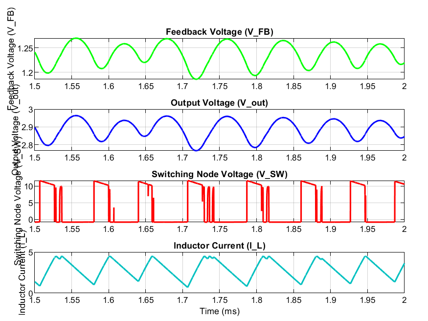

## Steady-State Waveform Analysis

**Figure X. Steady-state operation of the reconstructed LM2596 adjustable buck converter model under a 12 V input and approximately 3 A load condition.**

The figure presents the primary operating waveforms of the Stage 2 LM2596 model after startup transients have decayed and the converter has reached periodic steady-state operation. The displayed interval spans from 1.5 ms to 2.0 ms and includes the feedback voltage, output voltage, switching node voltage, and inductor current.

### Feedback Voltage (VFB)

The feedback voltage oscillates around the LM2596 internal reference voltage of approximately 1.23 V. The average value remains centered near the expected regulation point, indicating that the feedback network and compensation components are functioning correctly. Small variations in the feedback voltage correspond directly to output voltage ripple and normal closed-loop regulator operation.

### Output Voltage (VOUT)

The output voltage remains regulated near 2.9 V throughout the observation window. A periodic ripple component is visible and follows the switching activity of the converter. The average output voltage agrees closely with the value predicted by the reconstructed feedback divider network, confirming that the regulator is maintaining the intended operating point.

### Switching Node Voltage (VSW)

The switching node waveform alternates between the input voltage and the freewheeling diode conduction voltage, which is characteristic of buck converter operation. The periodic switching pattern indicates stable operation of the regulator. Additional narrow switching pulses are present within some cycles, suggesting dynamic duty-cycle adjustment by the internal control loop as it maintains output regulation.

### Inductor Current (IL)

The inductor current exhibits the expected triangular waveform associated with continuous-conduction mode (CCM) operation. Current increases while the internal switch conducts and decreases while the freewheeling diode carries current during the off-state. The current remains strictly positive throughout the switching cycle, confirming that the converter remains in CCM under the specified load conditions.

### Summary

Several important characteristics can be observed from the steady-state waveforms:

- Feedback voltage remains centered near the LM2596 reference voltage of 1.23 V.
- Output voltage remains regulated near the intended operating point.
- Inductor current exhibits continuous-conduction mode behavior.
- The switching node demonstrates stable periodic operation.
- Closed-loop feedback regulation is actively controlling converter operation.

These results indicate that the reconstructed LM2596 model is producing physically reasonable steady-state behavior and can serve as a baseline for future comparison with measured hardware waveforms.
