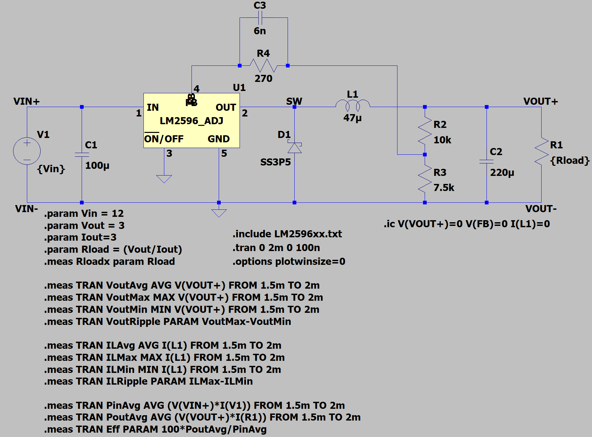

# Stage 2b LTspice Model

*Figure X. Stage 2b LTspice implementation of the LM2596 adjustable buck converter model. The model incorporates an SS3P5 Schottky diode as a first-order substitute for the SS34 diode observed on the physical converter module.*

## Description

This schematic represents the Stage 2b refinement of the LM2596 converter model. The overall converter topology remains unchanged from Stage 2, consisting of the LM2596 adjustable regulator, a 47 µH output inductor, a 220 µF output capacitor, and a resistive feedback divider configured to produce an output voltage of approximately 3 V from a 12 V input source.

The primary modification introduced in Stage 2b is the replacement of the original 1N582x Schottky diode model with the LTspice-native SS3P5 Schottky diode model. This change was motivated by inspection of the physical converter module, which was found to utilize an SS34 surface-mount Schottky diode rather than a 1N582x-family device.

Although the SS3P5 is not an exact representation of the installed SS34 diode, both devices are intended for switching power supply applications and possess similar current ratings. The SS3P5 therefore serves as an intermediate approximation until an SS34-specific SPICE model can be obtained or developed.

## Parameterization

The model was configured to support load-current sweeps through the use of LTspice parameters:

$$
R_{Load}=\frac{V_{OUT}}{I_{OUT}}
$$

where:

- $V_{OUT}=3\,V$
- $I_{OUT}$ is varied during simulation
- $R_{Load}$ is automatically recalculated for each operating point

This approach allows converter behavior to be evaluated across a range of load currents without manually modifying the load resistor value.

## Simulation Measurements

A collection of automated measurement statements was added to support steady-state performance evaluation. Measurements were collected over the interval from 1.5 ms to 2.0 ms to ensure that startup transients had decayed prior to analysis.

The measured quantities include:

- Average output voltage ($V_{OUT,AVG}$)
- Output voltage ripple ($V_{OUT,RIPPLE}$)
- Average inductor current ($I_{L,AVG}$)
- Inductor current ripple ($I_{L,RIPPLE}$)
- Average input power ($P_{IN}$)
- Average output power ($P_{OUT}$)
- Estimated converter efficiency ($\eta$)

These measurements provide the basis for evaluating load regulation, conduction mode transitions, ripple behavior, and efficiency trends across the simulated operating range.

## Purpose

The purpose of Stage 2b is to improve the physical fidelity of the converter model while maintaining the same control-loop architecture established in Stage 2. The resulting model serves as a bridge between the idealized converter developed during earlier stages and the eventual hardware characterization of the physical LM2596 module.
